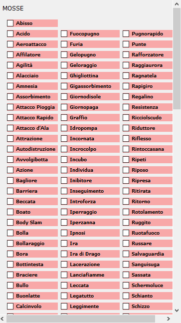

# GEC Assist Tool
The GEC Assist Tool is a graphical tool to keep track of the  progress made during the Get Everything Challenge in Pokémon. The tool allows to easily monitor the progress throughout the game without the need to memorize the progress made. The instrument is designed to act as a frame for the game, having  hole in the middle where put the game, and allowing to resize the borders to fill what remains uncover. Once in position, it is possible to use the ``block`` button to anchor the tool such that it remains on top and does not disappears when clicking outside of the window.

The tool allow for the control all of following requirements, needed to complete the GEC challenge:

### 1.  All Pokémons

The first requirement of the challenge is to **catch all the pokémon** in the regional dex and obtain a *living dex*. The tool allows users to easily monitor the progress by offering a table with all Pokémon present in the dex and a counter in the top right of the GUI. Clicking on a Pokémon icon will switch its color between three possibilities:
1. **Gray**: Pokémon not caught yet
2. **Colored**: Pokémon caught and present in the living dex
3. **Blue**: Pokémon soon-to-be obtained (i.e. by evolution, trade, etc.)

### 2. All Instruments

The second achievement to get to complete the challenge is to obtain **every single item** in the game.
 
This feature is paired with the Route Tracker, which shows the progress per each route, including items present in it. Items marked with *(H)* are hidden, whereas pther items can be seen.

The total number of items displayed is computed as *the sum of all pick-up items plus one for each purchasable-only* items

### 3. All Trainers

The third goal for the challenge is to **battle every trainer** in the game. This also includes optional and missable fights. Trainer battles accessible only throughout glitches do not count.

The tool allows, through the Route Tracker, to see all trainers in each floor of a route alongside their team, to easily mark the ones already defeated from missing. Checking a trainer will automatically increase the counter, while unchecking it will lower the counter. Trainers with multiple possible teams (e.g. rivals) are counted as a single instance, although all their possible teams are shown.

### 4. All Moves

The third requirement is to **see at least once all the moves** in the game, Struggle included. The Tool offers a practical list on the left of the route tracker on the right with a checklist for all the moves, which will automatically increase the counter.

Once a move has been marked, it will disappear from the list and will reappear inside a second list at the bottom, marked in green. From this second list it is possible to un-mark a move to make it reappear inside the un-marked move list.
### 5. All Other Stuff
 

The last category groups up all remaining miscellaneous elements which must be performed. This groups count elements such as:
- Interacting with all fixed pokémons (such as Snorlax or trap Voltorbs)
- Completing all in-game trades
- Get all gifted pokémons. Pokémons under this category include also bought ones (such as Magikarp) but not one obtained at the casinò, as these ones are repetible
- If slot machines are in the game, a **777**, or its equivalent, must be obtained at least once

## The Route Tracker Window
The Route Tracker Window is a secondary element which opens together with tha main GUI. This window displays a static list with all moves and, for a selected route, all items, trainers and events grouped by their location inside the map. All elements are shown alongside a checkbox to mark them as completed/obtained and to increase the corresponding counter.

On the top of the windows there is a combobox, to easily change the route currently displayed. Routes are presented in alphabetic order.

## Saving and deleting data
The tool automatically saves the data once one of the two main windows is closed. To delete all the data it is possible to:
1. Unmark everything
2. Delete the file present ``Datapack/Data/data.json`` that keeps track of the progress

## Version differences:
At the moment two different version of the GEC Assist tool are available. Their differences lies in how their layout is presented:
- The regular version offers a layout for pokédex and items which is expandale and scrollable, with icons alligning to take space available.
- The *Stream* version instead uses a fixed layout, which do not scale with the windows size but does not have any scrollable areas, leaving all icons visible at the same time.

To alternate which version to use, change it from the Config.ini file

## Credits
- **LetalStrems** (https://www.twitch.tv/letalstreams) for developing the challenge and its rules
- **PMDCollab SpriteCollab** (https://sprites.pmdcollab.org/) for pokémons' portraits used in the Pokédex:
- **DougDoug and collaborators** (https://www.dougdoug.com/twitchplays) for Twitch chat plays code.