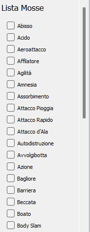

# GEC Assist Tool
The GEC Assist Tool is a graphical tool to keep track of the  progress made during the Get Everything Challenge in Pokémon. The tool allows to easily monitor the progress throughout the game without the need to memorize the progress made. The instrument is designed to act as a frame for the game, having  hole in the middle where put the game, and allowing to resize the borders to fill what remains uncover. Once in position, it is possible to use the ``block`` button to anchor the tool such that it remains on top and does not disappears when clicking outside of the window.

The tool allow for the control all of following requirements, needed to complete the GEC challenge:

### 1.  All Pokémons

The first requirement of the challenge is to **catch all the pokémon** in the regional dex and obtain a *living dex*. The tool allows users to easily monitor the progress by offering a table with all Pokémon present in the dex and a counter in the top right of the GUI. Clicking on a Pokémon icon will switch its color between three possibilities:
1. **Gray**: Pokémon not caught yet
2. **Colored**: Pokémon caught and present in the living dex
3. **Blue**: Pokémon soon-to-be obtained (i.e. by evolution, trade, etc.)

### 2. All Instruments
 
 The second achievement to get to complete the challenge is to obtain **every single item** in the game. This comes according to the following rules:
 1. Every item in each route **must** be picked up, invisible items included
 2. Items which cannot be found in routes *must be bought*
 3. It is possible to buy an item only after it has been found at least once, if possible. For items of point 2 this rule does not apply

The tool allows to track the progress easily thanks to its item cout. This feature is paired with the Route Tracker, which shows the progress per each route, including items present in it.

The total number of items displayed is computed as *the sum of all pick-up items plus one for each purchasable-only* items

### 3. All Trainers
 
The third goal for the challenge is to **battle every trainer** in the game. This also includes optional fights. The tool allows, through the Route Tracker, to see all trainers in each floor of a route alongside their team, to easily mark the ones already defeated from missing. Checking a trainer will automatically increase the counter, while unchecking it will lower the counter. Trainers with multiple possible teams (e.g. rivals) are counted as a single instance, although all their possible teams are shown.

### 4. All Moves
 
The third requirement is to **see at least once all the moves** in the game, Struggle included. The Tool offers a practical list on the left of the route tracker on the right with a checklist for all the moves, which will automatically increase the counter.

To mark a move as "*seen*" one of the following requirement must be met:
1. The move is performed by a member of the player's party
2. An enemy Pokémon perform the move

In all previous cases, it is **required the move to hit** and the animation to play. For multi-hit moves, only one hit is sufficient. 

### 5. All Other Stuff
 
The last category groups up all remaining miscellaneous elements which must be performed. This groups count **interactions** such as trades with NPCs, obtaining certain achievements or battling certain Pokémons. All this requirements can be found in the Route Tracker window, where they are found under the `Event` label

## The Route Tracker Window
The Route Tracker Window is a secondary element which opens together with tha main GUI. This window displays a static list with all moves and, for a selected route, all items, trainers and events grouped by location inside the map. All elements are shown alongside a checkbox to mark them as completed/obtained and to increase the corresponding counter.

On the top of the windows there is a combobox, to easily change the route currently displayed. Routes are presented in alphabetic order.

## Saving and deleting data
The tool automatically saves the data once one of the two main windows is closed. To delete all the data it is possible to:
1. Unmark everything
2. Delete the file present ``Data/data.json`` that keeps track of the progress

## Credits
Credits to **PMDCollab SpriteCollab** (https://sprites.pmdcollab.org/) for Pokémons portrait used for the dex list.